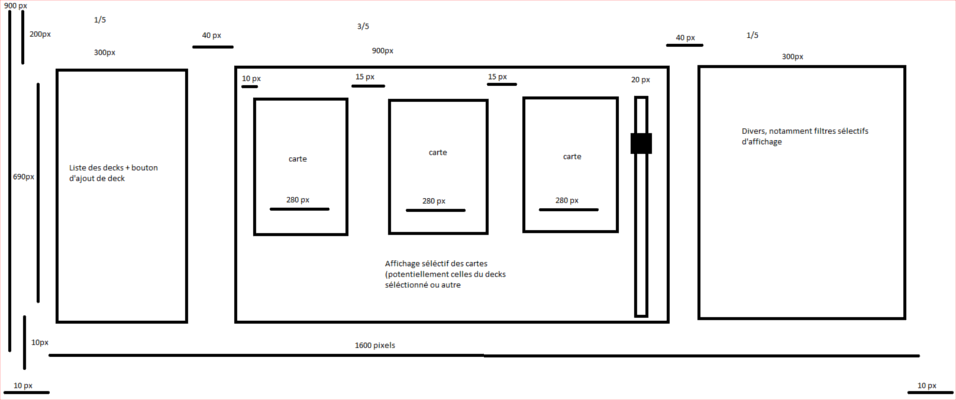
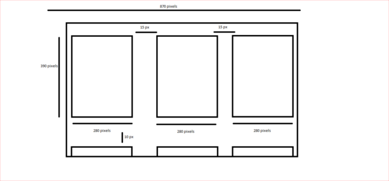
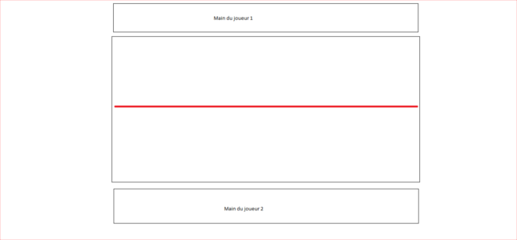

<head>
	<meta charset="utf-8" />
	<title> Rapport projet d'informatique 2019 : Magic the gathering (MTG) en Python - Moteur de jeu </title>
</head>

# Rapport projet d'informatique 2019 : Magic the gathering (MTG) en Python - Moteur de jeu
## Pierre Ayanides, Antoine Bedin et Gabriel Farago
### 01/04/2019

------------------------------------------------------------------------------------------

## Introduction

L'objectif de ce moteur de jeu (*game engine*) en Python est de permettre à deux joueurs (sur le même ordinateur) de jouer une partie du jeu de cartes à collectionner Magic The Gathering (MTG) l'un contre l'autre en format modern (c'est-à-dire avec un deck de 60 cartes relativement récentes), en respectant les nombreuses règles contraignantes de MTG. Sans application graphique, le dialogue avec les joueurs se fait en console Python par des commandes spécifiques.  Mais l'objectif final est que ce moteur de jeu sous-tende l'application de jeu graphique utilisant Pygame, en lui fournissant les informations sur l'état du jeu, et en recevant d'elle les choix effectués par les joueurs.

Les règles de MTG sont au premier abord assez simples, mais les nombreux mécanismes et spécificités du jeu ainsi que le grand nombre de cartes parues en ont fait un ensemble très complexe, mais aussi très logique et parfaitement adapté à l'orientation objet de Python (cf. le fichier *documents/regles_completes*, les règles officielles de MTG qu'il nous a fallu lire). Seules les applications de Magic les plus élaborées (telles MTG Arena, développée par l'entreprise productrice du jeu, Wizards of the Coast Inc.) peuvent implémenter cette complexité. Mais puisqu'elle est constitutive de MTG, nous avons eu comme objectif de créer un programme capable d'intégrer la plus grande partie des mécanismes de MTG que nous-mêmes n'avons pas codés. De nombreux éléments importants de la structure de notre programme n'ont donc pas d'utilité visible, mais serviraient en cas de futures améliorations. De plus, nous voulions réaliser un code relativement compréhensible même pour un néophyte de MTG, modulé en 5 fichiers clairement hiérarchisées (dont le plus important est naturellement celui de la classe *Game*) :

+ main.py ;
+ game.py ;
+ player.py ;
+ objects.py ;
+ functions_engine.py.

Cependant, ce choix n'a pas suffisamment réduit la quantité de fonctionnalités à organiser et à programmer, de sorte que le moteur de jeu n'est pas encore fonctionnel. Nous allons donc présenter d'abord nos réflexions sur l'implémentation des principes de base de MTG, ensuite expliciter certains aspects spécifiques de notre programme, puis présenter les plus importants éléments restant à réaliser, dans le jeu et sur le plan informatique/interface :

+ I. Concepts
    + A) Objets
    + B) Identifiants
    + C) Action
    + D) Tour
    + E) Fin du jeu
+ II - Analyses
    + A) Téléchargement
    + B) Gestionnaire de jeu
    + C) Cycle de Priorité
    + D) Process decision
    + E) Process effect
+ III - À venir
    + A) Capacités
    + B) Comparaisons
    + C) Autres
    + D) Fragilités
    + E) Liaison graphique

## I - L'implémentation des concepts de MTG

Nous exposerons ici les concepts globaux de MTG (sans s'attarder sur les nombreux Effets de cartes qui peuvent modifier la plupart des règles de base).

Nous expliquerons de manière très liée la manière dont nous les avons traduits informatiquement, en entrant d'emblée dans certains mécanismes avancés de MTG et en décomposant tous les éléments et actions du jeu. Le côté ludique de MTG risque donc d'être moins présent (notamment à cause des nombreuses formulations assez lourdes que nous avons dû utiliser), et nous ne pourrons fournir une vision d'ensemble du jeu. Nous vous conseillons donc fortement de lire le fichier *documents/regles_base*.

### A) Objets

MTG (dans le format modern sur lequel nous travaillons) est un jeu à deux Joueurs, qui représentent dans l'imaginaire de MTG deux puissants sorciers lançant des sorts pour vaincre l'autre (cf. **IG-Fin du jeu**). Nous représentons la Partie par une instance de la classe *Game*, qui aura comme Joueurs des instances de la classe *Player*. Toute communication de la Partie avec ses Joueurs se fera par l'intermédiaire des méthodes de communication en console de *Player* : 

+ `ext_com` pour un simple message informatif ;
+ `observe` pour permettre aux Joueurs d'observer l'état de la partie (selon ce qu'ils ont le droit de voir) en ligne de commande ;
+ `choice` pour recevoir la Décision d'un Joueur lorsqu'un choix lui est demandé.

La Partie fait jouer alternativement un tour à chaque Joueur jusqu'à être terminée (cf. **ID-Tour**).

La notion d'objet existe déjà dans MTG : chaque Joueur possède un deck, un ensemble de 60 cartes qui évolueront durant la partie dans différentes zones. Ces cartes du deck représenteront en fait, dans un jeu physique (et non informatique), différents objets selon la zone où elles se trouvent (cf. **IB-Identifiants**). Lorsqu'une carte du deck change de zone, l'objet qu'elle devient dans sa nouvelle zone n'a plus aucun rapport avec l'objet qu'elle était dans sa zone précédente (qui n'existe plus). À partir d'une carte du deck, on peut ainsi avoir selon la zone :

+ dans les zones Bibliothèque (*library*), Main (*hand*), Cimetière (*graveyard*) et exil (*Exile*), l'objet est une Carte ;
+ dans la zone Champ de bataille (*battlefield*), l'objet est un Permanent ;
+ dans la zone Pile (*stack*), l'objet est un Sort.

Ainsi, nous avons créé une classe *Game_object* fondamentale, dont héritent les classes *Card*, *Permanent* et *Spell*. On conservera cette terminologie pour éviter les confusion : les cartes du deck sont selon leur zone des Objets de jeu Cartes ou Sort ou Permanent, représentés dans notre programme par des instances des classes *Card* ou *Permanent* ou *Spell*. Il existe aussi deux Objets particuliers qui ne sont pas représentés par des cartes du deck dans le jeu physique : les jetons (*token*, en quelque sorte des permanents créés par des Effets) et les Effets sur la pile (*stack_effect*, en quelque sorte des sorts), que nous ne décrirons pas ici mais pour lesquels nous avons aussi construit des classes. Un changement de zone d'une carte du deck se traduit par la création d'une nouvelle instance de la classe appropriée placée dans la zone de destination, tandis que l'ancienne instance est retirée de la zone de départ (mais pas détruite).

Un objet de MTG est défini exclusivement par ses caractéristiques (*caracs*), qui sont imprimées sur la carte du deck à partir de laquelle il existe :

+ nom (*name*) ;
+ coût (*cost*) ;
+ coût converti de mana (*ccm*) ;
+ sur-type (*supertype*) ;
+ type (*type*) ;
+ sous-type (*subtype*) ;
+ texte (*text*) ;
+ couleur (*color*) ;
+ force (*power*) / endurance (*thoughness*) : pour les cartes de type créature (*creature*) seulement ;
+ loyauté (*loyalty*) : pour les cartes de type arpenteur (*planeswalker*) seulement.

Un objet peut avoir un nombre variable de ces caractéristiques, et celles-ci peuvent être modifiées par des Effets du jeu. Nous faisons donc la distinction, pour toute instance héritée de *Game_object*, entre les attributs (de type dictionnaire) *pcaracs* (pour les caractéristiques telles qu'imprimées sur la carte du deck) et *mcaracs* (pour les caractéristiques telles que modifiées par les Effets du jeu). Deux attributs importants sont à rajouter :

+ pour toute instance de *Game_object*, le propriétaire *owner* est le joueur qui possède l'Objet de jeu représenté par cette instance ;
+ pour toute instance de *Permanent* ou de *Spell*, le contrôleur *controller* est le joueur qui contrôle le Permanent ou Sort représenté par cette instance.

Au début de la Partie, dans l'initialisation des instances de *Player*, les 60 cartes du deck seront créées comme Objets Cartes, soit des instances de la classe *Card*, placés dans la bibliothèque. Pour cette instanciation originelle, le nom anglais uniformisé de la carte, fourni par la liste du deck du Joueur, est utilisé : il nous permet de rechercher dans notre base de données les caractéristiques imprimées de la carte de ce nom. Seule cette première instanciation demande un nom de carte. Lors d'un changement de zone (qui demande donc une nouvelle instanciation), ce sont les caractéristiques imprimées (*pcaracs*) de l'instance retirée de la zone de départ qui sont transmises à la nouvelle instance. Nous avons décidé de nommer ce procédé dérivation : tout changement de zone n'est en réalité que la création d'un objet dérivé de l'objet Carte initial créé à partit d'un nom de carte du deck.

À part ces attributs de caractéristiques et quelques autres attributs nécessaires aux Permanents et aux Sorts, les classes d'Objets de jeu sont assez rudimentaires et ont peu de méthodes. Afin de donner quelque repères pour la suite sans rentrer dans une explication plus détaillée (qui se trouve en **IIIA-capacités**), nous dirons seulement que les objets ont dans leur texte des capacités valables ou non selon la zone où l'objet se trouve et le contexte de jeu. Ces capacités sont :

- la capacité déclenchée, créant un effet si elle est déclenchée ;
- la capacité activée, créant un effet si elle est activés par un Joueur ;
- la capacité de sort, créant un effet quand l'objet sur lequel elle est se résout ;
- la capacité statique, créant un effet continu (CE) simplement quand elle est valable (les effets continus modifient les caractéristiques des Objets de jeu et permettent de modifier ou de déroger aux règles usuelles).

Enfin, deux attributs de *Game* sont importants :

- *log*, qui enregistrera tous ce qui se passe dans la partie (et pas seulement les événements au sens usuel du terme dans MTG), pour notre "débug" ;
- *history*, qui enregistrera tous les événements du jeu, pour les besoins de certaines capacités dépendant des événements passés.

### B) Zones et identifiants

Le placement et le retrait d'Objets dans les zones pose la question du stockage et de l'identification des instances. L'attribut *game_objects* de *Game* recense toutes les instances d'Objets de jeu ayant été créées depuis le début de la Partie, même si les Objets correspondants n'existent plus dans le jeu à proprement parler. Cet attribut est un dictionnaire associant chaque instance à son identifiant. L'identifiant est une chaîne de caractère comprenant deux parties séparées par un double point « : » :

+ la première est un nombre déterminé lors de la toute première instanciation, qui ne change pas lors des dérivations de l'objet durant les changements de zone : il indique donc de quelle carte du deck l'instance est dérivée ;
+ la seconde est un nombre incrémenté de 1 à chaque changement de zone la carte du deck qui représente l'objet de l'instance : il indique donc de quelle dérivation de cette carte du deck il s'agit.

Par exemple, une instance de *Card* d'identifiant *24:1* est en fait l'objet Carte initialement créé au début de la Partie comme une des 60 cartes du deck, puisqu'il n'a jamais été dérivé. Une instance d'identifiant *24:6* est la sixième dérivation de cette même carte du deck.

Un identifiant si complexe (et unique pour chaque instance, évidemment) a l'avantage de conserver les informations, ce qui est utile si, par exemple, un objet doit se référer à sa forme précédente dans une autre zone pour définir certains de ces attributs, comme le demandent certaines exceptions des règles. Plutôt que de stocker les instances d'objets directement dans des listes, les zones du jeu ne sont que des listes contenant les identifiants des instances. D'une manière générale, toute référence à un objet du jeu est sous la forme d'un identifiant, qui servira éventuellement à récupérer l'instance par l'intermédiaire du dictionnaire *game_objects*.

Ces zones, qui ne font que contenir les identifiants des Objets, sont individuelles (propres à chaque Joueur) ou collectives. Les zones individuelles sont :

+ Bibliothèque (*library* ou *lb*) : zone d'où les Joueurs piochent des Cartes, contenant initialement les 60 cartes du deck du Joueur ;
+ Main (*hand* ou *hd*) : zone où vont les Cartes piochées par le Joueur, les Cartes y sont disponible pour être jouées ;
+ Cimetière (*graveyard* ou *gy*) : zone où vont principalement les Permanents du Champ de Bataille détruits et les Cartes de la Main défaussées.
Les zones collectives sont :
+ Champ de Bataille (*battlefield* ou *bf*) : zone où vont les Cartes de permanent jouées par les Joueurs, et où se déroule l'action du jeu ;
+ Pile (*stack* ou *st*) : zone de transit où vont les Cartes que veut jouer le Joueur depuis sa Main ;
+ Exil (*exile* ou *ex*) : zone où vont les Cartes exilées.

Les classes nécessaires sont donc définies : la Partie, instance de *Game*, a comme objets esclaves les Joueurs de la classe *Player* et les Objets de jeu de la classe mère *Game_object*, ces derniers accessibles dans `game_objects` et ayant leurs identifiants dans la liste de la zone où il se trouvent. Chacun de ces objets a des attributs le définissant particulièrement, notamment les caractéristiques des Objets de jeu, les points de vie du Joueur et les Capacités à vérifier par la Partie (que nous expliquerons).

### C) L'action dans MTG:

Dans MTG, l'action au sens de ce qui se passe réellement, qui serait en quelque sorte visible dans le jeu physique, provient exclusivement des effets ponctuels (et non continus) et des décisions. C'est par exemple ces effets ponctuels et décisions qui peuvent déclencher des capacités déclenchées. Pour simplifier cette partie de notre rapport, nous utiliserons ici le terme d'Effet pour désigner les seuls effets ponctuels à opérer durant le jeu (il ne sera en effet pas question d'effets continus dans cette partie).

Les Effets peuvent être générés :

- par les actions basées sur le tour ("turn-based actions" ou "TBAs") : actions générées par le déroulement du tour (cf. **ID-Tour**) ;
- par les actions basées sur un état ("state-based actions" ou "SBAs") : actions demandées lorsque des conditions définies portant sur l'état des Objets de jeu ou des Joueurs sont atteintes, vérifiées presque constamment dans le jeu (cf. **IIC-Cycle de priorité**) ;
- par les capacités de sorts : lorsque cf. **IIIA-Capacités** ;
- par le paiement d'un coût.

Il nous a d'abord fallu répertorier les différents Effets et surtout leur paramètres : l'Effet de destruction de Permanent demande ainsi de savoir quel Permanent doit être détruit (en l'occurrence, ce paramètre sera l'identifiant de l'instance de *Permanent* concernée). Un Effet est de cette manière pour nous un simple dictionnaire indiquant le type de l'Effet et ses paramètres (qui dépendent du type). Nous avons donc créé une liste à peu près exhaustive des Effets que nous connaissions avec les paramètres qu'il nécessitaient (cf. le fichier "nomenclature" dans ./documents). Il ne suffisait pas ensuite de créer pour chacun de ces Effets une méthode dans la classe apporpriée réalisant effectivement l'Effet, car celui-ci doit être évalué par la Partie en raison de certaines Capacités et afin d'être enregistré dans l'historique de la Partie. Enfin, dès qu'un Effet arrive à son terme (c'est-à-dire qu'il se passe réellement quelque chose qui serait visible dans le jeu physique), la Partie doit réinitialiser ses attributs de Capacités à vérifier.

Le résultat de nos réflexions sur le sujet a donc été la création d'une méthode de *Game* nommée `process_effect`, qui centralise le traitement de tout Effet pour l'évaluer et, si l'état de la Partie l'autorise, le réaliser. Nous détaillons cette méthode en **IIE-Process effect**. Pour revenir aux Effets en eux-mêmes, il peuvent, selon leur type, soit donner suite à une réalisation directe (nous les appelons des Effets finaux), soit donner suite à un  nouvel effet pour lequel on appellera de nouveau `process_effect` (nous les appelons Effets intermédiaires) :

- un Effet de type destruction est un effet intermédiaire : il appelle une nouvelle fois `process_effect` pour cette fois réaliser un Effet final de changement de zone ;
- un Effet de type pioche est un effet final : il appelle directement la méthode `move_zone` de *Game* (car dans MTG, la pioche est synonyme de changement de zone de la Bibliothèque à la Main).

Ces effets s'exécutent indépendamment des joueurs, seuls certains peuvent demander un choix d'un Joueur parmi une liste de possibilités. Des choix qui ne sont pas issus d'effets peuvent aussi être demandés lors de l'arrivée sur le Champ de bataille, ou bien certains Sorts, les Sorts modaux, au moment où ils sont lancés. Dans ces trois cas, auquel cas nous appellerons simplement la méthode `choice` de *Player* : aucun de ces choix ne passe par `process_effect`.

Cependant, certaines Décisions des Joueurs sont plus complexes à appliquer. Elles sont demandées par des actions basées sur le tour (cf. **ID-Tour**) et concernent les actions mêmes des joueurs et non simplement leurs choix ; elles sont donc observées par la Partie au même titre que les Effets, selon une procédure qui peut donner lieu :

- à la constatation de l'illégalité de la Décision prise par le joueur : la Partie retourne alors a l'état où elle était avant la Décision et demande une nouvelle Décision ;
- à la détermination d'un coût pour que le joueur puisse prendre la Décision : le Joueur paie alors ce coût s'il le peut, sinon la Décision est illégale, ce qui renvoie à la possibilité ci-dessus.

Cette complexité nous a contraint à créer une autre méthode de *Game*, la méthode `process_decision`, que nous détaillons aussi en **IID-Process decision**.

Nous ne ferons pas de description de chacune de ces Décisions (cf. **ID-Tour** et **IIC-Cycle de priorité** pour plus d'informations). Voici simplement ce qui demande ces Décisions aux Joueurs :

- Décisions de lancer un Sort, jouer un Permanent terrain, activer une capacité activée : demandées lorsque le Joueur à la priorité ;
- Décisions de déclarer les attaquants et de déclarer les bloqueurs : demandées par des actions basées sur le tour aux étapes dédiées ;
- Décisions de cibler ("target") un objet du jeu : demandée lors du lancement d'un Sort ciblant et de l'activation d'une capacité activée ciblante et du déclenchement d'une capacité déclenchée ciblante (nous avons dû considérer "target" comme une décision par simplification) ;
- Décision d'activer une capacité de mana : demandée lors du paiement d'un coût et lorsque le Joueur à la priorité ;
- Décision de dégager ses créatures : demandée lors de l'étape de dégagement du Joueur.

Nous faisons une analyse plus précise de `Game.process_decision` et `Game.process_effect` en **IID-Process decision** et **IIE-Process effect**.

En dehors des Effets et Décisions, un autre élément d'action existe qui n'a cependant pas d'implications concrètes sur l'état du jeu et qui ne peut être empêché par les effets continus (CEs), et que nous ne comptons donc pas comme un effet : la résolution d'un Sort ou d'un Effet de pile sur la Pile. Ceci donne lieu soit à la réalisation des capacités de sort de l'objet en question (qui génèrent elles-mêmes, comme nous l'avons dit, des effets), soit à la création d'un Permanent sur le champ de bataille. La résolution d'un Objet de jeu sur la pile est néanmoins enregistré dans l'historique *self.history*.

### D) Tour et « timing »

Ces Effets et Décisions, qui représentent tous les événements de la Partie, s'inscrivent naturellement dans une structure chronologique linéaire et très définie qu'est le tour, géré par la Partie (donc par *Game*). Elle suit pour exécuter le tour d'un Joueur une succession de 5 phases (*phase*), elles-mêmes composées d'un certain nombre d'étapes (*step*). Chacune de ces étapes donne lieu à des actions basées sur le tour (*TBAs*). Le Joueur dont le tour est en train d'être exécuté est le Joueur actif, l'autre est le Joueur passif.

Notre instance de *Game*, lorsque sa méthode `mainloop` est appelée (à la fin de l'initialisation), débute le jeu en faisant piocher 7 Cartes à chaque Joueur, puis, pour chaque tour, définit l'ordre Joueur actif-Joueur passif (ordre *APNAP*) et fait boucler ses attributs *phase* et *step* sur le dictionnaire *turn_structure*. Pour chaque valeur de *step*, elle exécute les TBAs correspondantes dans le dictionnaire *TBAs*. Les TBAs peuvent être :

+ des Effets à faire passer par `process_effect` ;
+ des Décisions que les Joueurs doivent prendre ;
+ l'initiation d'un cycle de priorité, qui demandera lui-même des Décisions des Joueurs.

La structure complète et toutes les TBAs sont disponibles de manière à peu près claire dans les dictionnaires susdits (en tant qu'attributs de classe de *Game*).

La priorité est une notion essentielle du *timing* de MTG. Si un cycle de priorité est initié, la Partie fait passer la Priorité d'un Joueur à l'autre. Lorsqu'un Joueur reçoit la priorité, en plus de vérifications (celle des actions basées sur un état notamment), il a la possibilité de jouer quelque chose et doit donc prendre une Décision parmi :

+ lancer un Sort (`cast`) depuis sa Main : l'Objet de jeu Carte de sa Main est alors mis sur la Pile ;
+ jouer un Permanent de type terrain depuis sa Main (`land`) : l'Objet de jeu Carte de sa Main est alors mis sur le Champ de Bataille ;
+ activer une capacité activée d'un Permanent qu'il contrôle sur le Champ de Bataille (`active`) : un Objet de jeu Effet de pile (instance de *Stack_effect*) est alors mis sur la Pile (nous avons différencié `active mana` et `active`, cf. **IIA-capacités**);
+ utiliser une capacité spéciale d'un Permanent qu'il contrôle sur le Champ de Bataille (`special`) : cf. **IIIA-Capacités** ;
+ passer la priorité (`pass`).

Si les deux Joueurs ont passé la priorité, le cycle de priorité se termine et le dernier Objet de jeu Sort mis sur la Pile se résout. Nous détaillons ces procédures en **IIC-Cycle de priorité** et **IIID-Autres**. De plus, quand un joueur doit recevoir la priorité, on vérifie juste avant les actions basées sur un état, qui sont par exemple :

- si un Permanent (donc Objet de jeu sur le Champ de bataille) de type créature a sur lui un nombre de blessures supérieur ou égal à son endurance, génération d'un Effet de destruction de Permanent ;
- si un Joueur a un total de point de vie inférieur ou égal à 0, génération d'un Effet de défaite de ce joueur.

### E) Fin du jeu

Il existe plusieurs façons de terminer la Partie.

Lors de la vérification des actions basées sur un état, un Effet de défaite pour un Joueur sera créé si :

+ son total de point de vie, initialement à 20, est à 0 ;
+ son total de marqueurs poison, initialement à 0, est à 10 ;
+ s'il a tenté de piocher une carte de sa bibliothèque alors que sa bibliothèque était vide.

Ces trois conditions sont décrites par des attributs des instances de la classe *Player*, qui sont donc vérifiés avec les autres conditions d'actions basées sur un état.

Les Effets de défaite et de victoire peuvent ainsi être générés par ces actions basées sur un état, ou bien simplement par des sorts ou des Capacités. Ils indiquent un gagnant, un perdant ou deux perdants (mais jamais deux gagnants). En pratique avec Python, le problème qui s'est posé à nous est que l'exécution d'un Effet de victoire ou défaite, après son passage à travers toute la méthode `process_gf`, appelle une méthode de fin de jeu `endgame`. Celle-ci peut enregistrer un vainqueur, mais ne peut réellement empêcher que le flux d'exécution ne continue : l'exécution de lignes de code dans toutes les méthodes de *Game*, depuis `mainloop`, ayant conduit à l'appel de `endgame`, se poursuivait nécessairement. Ceci nous a conduit à créer une classe *Game_manager* ayant une fonction de `wrapper` capable de réinitialiser le jeu depuis l'extérieur (cf. **IIB-Game manager**).

## II - Analyse de code

Nous expliquerons ici les passages les plus intéressants et les plus plus ardus de ce que nous avons réussi à terminer, c'est-à-dire principalement ce qui touche aux mécanismes même du jeu implémentés dans une architecture de classes.

### A) Téléchargement des cartes

Comme nous l'avons dit, nous définissons un Objet du jeu par ses caractéristiques imprimées *pcaracs*. Au début de la Partie, nous recevons ces caractéristiques de notre base de donnée SQLite3 *card_db* dans la section ./cards. Pour obtenir cette base de données, nous avions besoin d'un programme qui puisse trouver sur Internet la page du site *scryfall.com* de description d'une carte MTG de nom donné, puis extraire du HTML de cette page les caractéristiques imprimées de la carte et les enregistrer. Ceci a donné lieu à un sous-projet touchant à la fois aux bases de données (module *sqlite3*), à l'accès à Internet (module *urllib*) et au *parsing* d'un document HTML (module *HTMLParser*).

En premier lieu, il a fallu manuellement identifier dans le code HTML les informations caractérisant les cartes. Le site étant parfaitement normalisé, nous nous sommes rendu compte que l'on pouvait trouver les informations grâce à certaines balises porteurs d'attributs bien précis. Seulement, ce travail avait été fait pour la page d'une carte tandis que le script de téléchargement devait télécharger les cartes en masse. Ainsi, en analysant le code HTML des pages des éditions (regroupant chacune environ 250 cartes), nous avons vu que l'on pouvait toujours trouver l'url de la page de chaque carte contenue dans l'édition grâce à certaines balises et les attributs qu'elles portent. Nous n'avons pas cherché à généraliser en cherchant l'url de la page de chaque édition car chaque édition prenait environ 600 Mo de place.

Ainsi, nous avons créé deux objets Parser héritant de HTMLParser, l'un destiné à analyser le code d'une page d'édition, et l'autre destiné à analyser le code d'une page de carte. La récupération des informations à partir des codes HTML s'appuya donc sur la *stack* : c'est une pile des balises ouvertes et non refermées. Le principe est simple et s'appuie sur les méthodes de HTMLParser. Celui-ci « lit » le code HTML grâce à la méthode `feed` : la méthode `handle_starttag` est déclenchée lorsqu'un tag ouvrant est « lu » tandis que `handle_endtag` est déclenchée lorsque c'est un tag fermant. Un tag auto-fermant déclenche donc successivement ces deux méthodes. Ainsi, à chaque tag ouvrant, on le rajoute (avec ses attributs) à la stack, tandis qu'un tag fermant supprime la dernière balise de la *stack*. L'utilisation de la méthode `elems_stack` dans `handle_tag` permet l'affichage des balises ouvertes successivement, soit un arbre généalogique de la balise ouverte.

Afin de récupérer les informations, nous avons donc établi des critères sur les balises ouvertes, mais il a fallu généraliser ces critères. C'est exactement ce que fait la fonction `cond_get` :

		def cond_get(stack, stag1, sval1=None, stag2=None, sval2=None): # prend en paramètre la pile <stack> et les termes de la recherche (tag et attributs)
			"""Fonction vérifiant un critère de recherche dans la liste <stack>"""
			tag2, attr2 = stack[-2][0], stack[-2][1]
			tag1, attr1 = stack[-1][0], stack[-1][1]
			if stag2: # si la recherche porte sur la dernière balise ouverte, sa balise parent et leurs attributs
				if stag1==tag1 and stag2==tag2 and ("class", sval2) in attr2: # vérification de la correspondance aux termes de la recherche <stag> et <sval>
					return True
			else: # si la recherche porte uniquement sur la dernière balise ouverte et ses attributs
				if stag1==tag1 and ("class", sval1) in attr1: # vérification de la correspondance aux termes de la recherche <stag> et <sval>
					return True
			return False

La recherche portant sur la dernière balise ouverte (*stag1*) et ses attributs mais aussi potentiellement sur la balise parent (*stag2*) et ses attributs. Précisément, c'est la valeur de l'attribut *class* qui nous intéresse, c'est pourquoi on cherche ici à savoir si le(s) tag(s) cherché(s) correspond(ent) aux critères de recherche.

Ainsi, il a fallu récupérer les informations, ce qui est possible grâce à la méthode `handle_data` qui traite les informations contenues dans les balises. En vérifiant les critères pour chaque caractéristique d'une carte, on peut donc remplir un dictionnaire les regroupant : c'est *caracs*, qui est renvoyé par la méthode `get_caracs`. Ces informations sont traitées et normalisées juste avant la fin, c'est à dire à la fermeture de l'avant-dernière balise. La classe *IndexParser*, elle, ne regroupe pas les caractéristiques de chaque carte, mais collecte les urls des cartes trouvées dans une page d'édition donnée, et les renvoie par la méthode `get_urls`.

Les deux objets Parser créés, il s'agissait maintenant de trouver une manière de stocker toutes les informations que l'on allait télécharger. La solution la plus élégante et la plus pratique fut d'utiliser le module *sqlite3*, permettant la gestion de base de données SQLite avec python. C'est donc dans la fonction `add_db` que tout se passe. Après la création des dossiers, après s'être connecté à la base de données et avoir initialisé un objet *IndexParser* et un objet *CardParser*, le code se présente ainsi (en retirant l'affichage du log) :

		page = urlopen("https://scryfall.com/sets/{0}".format(extension))
		urls = index_parser.get_urls(page.read().decode("utf-8")) # décodage et lecture de la page pour récupérer les urls grâce à <index_parser>

		for rank,url in enumerate(urls,1): # parcours des cartes de <extension>, avec <rank> le numéro de la carte dans l'ordre de téléchargement
			card = urlopen(url)
			caracs = card_parser.get_caracs(card.read().decode("utf-8")) # décodage et lecture de la page pour récupérer les caractéristiques grâce à <card_parser>
			urlretrieve(caracs["image"],"{0}/{1}/{2} {3}.png".format(image_repository, extension, caracs["setnumber"], caracs["cardid"])) # téléchargement et enregistrement de l'image
			req = """INSERT INTO card VALUES ("{0}", {1})""".format("', '".join(caracs[key] for key in caracs.keys() if (key != "image" and type(caracs[key]) == str)), caracs["setnumber"])
			cur.execute(req) # insertion des caractéristiques dans la table card
			conn.commit() # insertion du contenu du curseur dans la base de données

Ainsi, pour chaque url récupérée grâce à *index_parser*, on collecte les caractéristiques de la carte associée, et on les insère dans la base de données, tandis qu'on télécharge l'image de la carte, tout cela grâce à card_parser. À la fin du téléchargement dont la durée est principalement dû au téléchargement des images, le script *thumbnailer* est appelé pour créer une image plus petite et mieux adaptée au moteur graphique. Ce script assez simple s'appuie sur le module *PIL* permettant de créer des miniatures.

En fin de compte, le script s'est révélé très adapté et surtout très résilient puisque la structure du site *scryfall.com* a changé durant le développement du *downloader* ! Mais après quelque recherches dans le nouveau code HTML, seulement quelques remplacements de critères se sont révélés suffisants pour rendre le script à nouveau opérationnel.

Le script a donc permis la récupération automatique des informations de centaines de cartes, ainsi que le téléchargement de leur image en très bonne résolution (la meilleure résolution trouvable sur le web). La flexibilité et l'intelligence des bases de données SQLite s'adaptent parfaitement à l'usage qui en sera fait par le moteur de jeu et le moteur graphique. Cependant, MTG étant un jeu possédant un très grand nombre de cartes, certaines informations sont plus difficiles à récupérer, c'est pourquoi la version 3.0 de *downloader* permet la récupération de certaines informations que la version 2.2 ne permet pas. Cependant, afin de préserver la lisibilité et la compréhensibilité du script, et parce que la diversité des cartes disponibles dans le jeu est limitée par les capacités du moteur de jeu, c'est la version 2.2 qui est utilisée pour réaliser le projet.

### B) Game manager

Nous avons passé un certain temps sur le problème de terminer la Partie une fois qu'un joueur a gagné, c'est-à-dire d'arrêter le flux d'exécution en cours dans les méthode de l'instance de *Game* sans mettre une condition de type `if self.game_ended==False:` devant chaque ligne de code. Nous aurions pu de façon similaire placer cette conditions dans les méthodes de communication avec les Joueurs afin qu'ils ne se rendent pas compte du fait que la partie continue, mais cela posait d'autres problèmes (un nouvel effet de victoire ou défaite pourrai être généré dans la suite de l'exécution par exemple).

Nous avons en réalité d'abord pensé à détruire complètement l'instance de *Game*, dans sa méthode `endgame` ou bien depuis l'extérieur, ce qui a défaut d'être propre résoudrait directement le problème. Mais l'instruction `del variable` de Python ne fait que détruire la référence *variable* à l'instance visée. L'instance elle-même, dans son emplacement mémoire, peut continuer d'exister et de s'exécuter. Ce qui vide vraiment l'espace mémoire de l'instance est le *garbage collector* de Python, et il ne le fait que quand il constate que l'instance n'est plus utilisée, c'est-à-dire qu'elle n'est plus référencée par aucune variable. 

Nous avons donc voulu que la méthode `endgame` détruise toutes les références à l'instance de *Game* en cours d'exécution, déjà à l'aide d'une classe wrapper, de façon à ce que le *garbage collector* se mette en œuvre. Nos tests, reprenant l'architecture de *Game*, à l'aide des modules *sys* et *gc* (un exemple parmi d'autres : le fichier *tests/classes_suicide*) nous ont en fait montré que nous n'étions pas capable de détruire une instance ayant des méthodes en cours d'exécution. Même si toutes les références à une instance sont détruites  (ce qui est très difficile), tant que ses méthodes n'ont pas été entièrement exécutées, l'instance est effectivement considérée comme *tracked* par le *garbage collector* mais ce dernier ne réussit pas à l'« attraper ». Cet échec nous a du moins permis d'explorer les modalités de l'exécution en Python, ce qui fut intéressant quoique parfois déroutant.

Nous avons donc dû modifier notre idée d'origine. Nous voulions créer une classe *Game_manager* (représentant environ une table de jeu) qui, pour chaque nouvelle Partie entre A et B, crée une nouvelle instance de *Game* référencée par son attribut *game*. À la place, une instance de *Game* est effectivement créée à la toute première partie entre A et B, dans la méthode `new_game` de *Game_manager*, de cette manière :

		self.game = Game(self.decks,self,self.starting_player)

Mais cette instance sert aussi pour toutes les parties suivantes. Ainsi, lorsque la méthode `endgame` de *Game* est appelée, elle appelle elle-même la méthode `end_and_new` de *Game_manager* :

		def endgame(self,winner):
			"""Termine la partie par l'intermédiaire de l'objet maître <Game_manager>."""

			if winner == "=": # égalité : les deux joueurs perdent en même temps
				self.boss.end_and_new("=")
			else: # un joueur gagne
				self.boss.end_and_new(self.player_order[self.winner])

Puis cette méthode `end_and_new` appelle la méthode `new_game` de *Game_manager* (après avoir enregistré le résultat) :

		def end_and_new(self,win):
			"""Enregistre la victoire éventuelle d'un joueur durant la partie s'étant terminée et relance."""

			self.wins[win] += 1
			self.starting_player = self.opponents[win] # le perdant sera premier jouer de la prochaine partie

			if "o" in input("The result of last game has been {0}. New game ? (y or n) : ".format(win)).lower():
				self.new_game()
			else:
				print("Table closed. Final results :",self.wins)
				sys.exit() # fin brutale de l'exécution des méthodes de <Game_manager> et de l'instance de <Game> courante

Et `new_game` réinitialise l'instance de *Game* stockée dans son attribut *game*, ce qui relance une partie et boucle le tout :

		def new_game(self):
			"""Crée l'objet <Game> de partie s'il n'existe pas ou le réinitialise s'il existe, pour une nouvelle partie."""

			self.deck_choice()
			if not(self.starting_player):
				self.starting_player = rdm.choice(["A","B"])

			if not(self.game): # vérification du fait qu'encore aucune partie n'a été créée
				self.game = Game(self.decks,self,self.starting_player)
			else:
				self.game.__init__(self.decks,self,self.starting_player)

Donc les méthodes de *Game* n'ayant pas fini leur exécution lors de l'appel de `endgame` attendent en réalité toujours de s'exécuter, mais elles ne le pourront jamais car une nouvelle partie a commencé avec l'exécution de ses propres méthodes. Une nouvelle couche d'exécution a en quelque sorte été appliquée, qui sera elle aussi recouverte à la prochaine partie. Lorsque A et B ne veulent plus faire de parties, toutes ces couches sont oubliées puisqu'on sort de Python par la fonction `sys.exit`, qui réalise une sorte de *ctrl+D* assez brutal.

### C) Cycle de priorité

Le cycle de priorité de MTG est lié à la zone Pile. Il fait passer la priorité alternativement à l'un puis à l'autre Joueur indéfiniment, tant qu'ils continuent à prendre des Décisions. Les premiers cycles de priorité sont initiés par les actions basées sur le tour ("TBAs").

Comme nous l'avons mentionné, un Joueur ayant la priorité a la possibilité de prendre une Décisions parmi, entre autres et sous conditions : poser un Permanent de type terrain sur le Champ de bataille, utiliser une capacité spéciale, activer une capacité activable de mana. Ces trois premières Décisions (une fois passées par `process_decision` se traduisent immédiatement en l'arrivée du Permanent terrain sur le Champ de bataille ou en l'ajout de mana dans la réserve deu joueur ayent activé la capacité de mana (cf. **IIIA-Capacités**), par exemple. On dit que ces actions ne passent pas par la Pile, et un joueur les ayant prises a après leur réalisation toujours la priorité.

Mais deux autres possibilités de Décisions proposées au Joueur ayant la priorité agissent sur la Pile : la réalisation des Décisions de lancer un Sort ou d'activer une capacité activée qui n'est pas de mana provoque la mise sur la Pile d'un Objet de jeu Sort ou d'un Objet de jeu Effet de pile (le déclenchement d'une capacité déclenchée peut aussi mettre un Objet de jeu Effet de pile sur la Pile, cf. **IIIA-Capacités**). On créera donc à ces occasions des instances des classes *Spell* et *Stack_effect* . Ces Objets de jeu attendent de se résoudre, c'est-à-dire de donner lieu à ce pourquoi le Joueur les ayant mis sur la Pile les a joués :

+ un Sort de type permanent se résout en prenant la forme de Permanent (instance de *Permanent* sur le Champ de bataille) ;
+ un Sort de type éphémère ou rituel se résout en créant des Effets correspondant à ses capacités de sort puis en prenant la forme de Carte dans le Cimetière ;
+ un Effet de pile se résout en créant des Effets correspondant à ses capacités de sort puis en disparaissant.

Une fois qu'une telle Décision d'un joueur s'est réalisée, le cycle de priorité en cours ne continue pas : un autre cycle de priorité commence par-dessus ce cycle de priorité, avec comme premier Joueur à recevoir la priorité le Joueur ayant pris la Décision. Durant ce nouveau cycle, les Joueurs pourront prendre de nouveaux de telles Décisions et initier encore d'autres cycles de priorité. Seulement quand un cycle de priorité a déjà fait passer la priorité aux deux Joueurs et qu'ils ont tous deux passé ("pass"), le dernier élément mis sur la Pile se résout (cf. le fichier *documents/regles_base* pour un exemple concret). Une fois qu'il est résolu, ce cycle de priorité est terminé et :

+ soit il y a encore un élément sur la Pile, ce qui signifie logiquement qu'un cycle de priorité est encore en cours en-dessous de celui qui vient de se terminer : on reprend alors ce cycle de priorité là où il en était resté :
+ soit la Pile est vide, ce qui signifie logiquement que le cycle de priorité venant de se terminer était le tout premier de l'étape en cours dans le tour, celui qui a été initié par une TBA : on passe alors à la prochaine TBA.

En plus de cette procédure vient d'ajouter, avant toute prise de priorité par un joueur, la vérification des actions basées sur un état et la mise sur la Pile d'Objets de jeu Effet de pile (instances de *Stack_effect* par des capacités déclenchées (cf. **IIIA-Capacités**). La réalisation des Effets générés par les SBAs peut demander la réalisation d'autres SBAs et aussi déclencher d'autres capacités déclenchées, de sorte que le joueur qui devrait prendre la priorité doit attendre que plus aucune SBAs n'ait été déclenchée lors de la dernière vérification et qu'aucun Effet de pile ne soit encore à mettre sur la pile pour enfin prendre sa priorité.

L'algorithme final que nous avons conçu s'appuie donc nécessairement sur la récursivité. Le voici en langage universel :

		VARIABLE GLOBALE apnap : liste des cardinaux des joueurs dans l'ordre du tour
		VARIABLE GLOBALE SBAs_exécutées : booléen
		VARIABLE GLOBALE capas_déclenchées_attente : liste de capacités déclenchées en attente
		VARIABLE GLOBALE pile : liste des objets sue la pile

		FONCTION boucle_SBAs()
			SBAs_exécutées = Faux
			vérification_SBAs()
			TANT QUE SBAs_exécutées ou au moins un élément dans capas_déclenchées_attente FAIRE
				SBAs_exécutées = Faux
				mettre_capas_déclenchées_sur_pile()
				vérification_SBAs()

		FONCTIONS cycle_de_priorité(initiateur)
			VARIABLE LOCALE joueur_prioritaire : cardinal du joueur prioritaire
			VARIABLE LOCALE décision_précédente : chaîne de caractères
			VARIABLE LOCALE décision : chaîne de caractères
			VARIABLE LOCALE initiateur : chaîne de caractères
	
			SI initiateur = "action basée sur un tour" ALORS
				joueur_prioritaire <- premier élément de apnap
			SINON
				ordre_priorité <- entier(initiateur)
	
			décision <- ""
			décision_précédente <- ""
	
			boucle_SBAs()
			décision <- résultat de la prise de décision du joueur de cardinal joueur_prioritaire
	
			TANT QUE non(décision = "passer" et décision_précédente = "passer") FAIRE		
				SI décision = "lancer" ou décision = "activer non mana" ALORS
					cycle_de_priorité(chaîne_de_caractères(joueur_prioritaire))
					joueur_prioritaire <- valeur_absolue(joueur_prioritaire - 1)
				SINON SI décision = "passer" ALORS
					joueur_prioritaire <- valeur_absolue(joueur_prioritaire - 1)
		
				boucle_SBAs()
				décision_précédente <- décision
				décision <- résultat de la prise de décision du joueur de cardinal joueur_prioritaire
	
			SI au moins un élément dans pile ALORS
				résoudre(dernier élément de pile)

Cet algorithme est traduit en Python dans la méthode `stack_cycle` de *Game*, en s'appuyant évidemment sur les attributs de *Game* en tant que variable globale. La variable *joueur_prioritaire* ou bien *player_prio* n'est pas un référence à l'instance de *Player* prioritaire, mais au cardinal du Joueur prioritaire. Ce format permet notamment de modifier sans trop de lourdeur le joueur prioritaire si besoin est :

		joueur_prioritaire <- valeur_absolue(joueur_prioritaire - 1)
		prio_player = abs(prio_player-1)

L'algorithme prend en compte les deux décisions précédentes prises durant ce tour de priorité (puisque le moteur de jeu n'admet que deux joueurs) pour modifier ou non le Joueur prioritaire et initier ou non un nouveau cycle de priorité. Le résultat de ces décisions s'obtient par :

		décision <- résultat de la prise de décision du joueur de cardinal joueur_prioritaire
		decision = self.players[prio_player].take_action(self.det_actions(prio_player))

`stack_cycle` ne gère en aucun cas la légalité des Décisions prises par les joueurs, ni leur réalisation effective : les Décisions qui lui sont fournies sont uniquement indicatives, leur légalité a été vérifiée et elles ont déjà été exécutées dans `Player.take_action` et `Game.process_decision` (cf. **IIID-Process decision**). Les méthodes de Python sont donc particulièrement adaptées, puisque `take_actions` propose au joueur, entité indépendante, de faire quelque-chose, et renvoie en même temps à `stack_cycle` sa décision finale par "return" comme une fonction, de sorte que `stack_cycle` n'a effectivement qu'à se préoccuper de la priorité.

### D) Process decision

Le traitement d'une Décision d'un Joueur suit un schéma régulier qui dépend des effets continus du jeu et ressemble à ceci dans un langage parlé :

1. Demander l'entrée d'une décision
2. Vérifier que la Décision est conforme aux principes de base de MTG et à ses conditions internes.
3. Réaliser les implications de la décision prise par le joueur.
4. Faire choisir à ce joueur les modalités de sa décision (cette instruction pouvant appeler une nouvelle demande de Décision pour cibler des objets).
5. (si un coût peut exister pour ce type de Décision :) Déterminer ce coût en fonction des modalités choisies et des effets continus du jeu.
6. Si le joueur prenant la Décision est capable payer le coût et que la Décision (comprenant ses modalités) est autorisée par les Effets du jeu
	-> la décision est légale et sa réalisation est confirmée (par une vérification des capacités déclenchées notamment).
7. Sinon-> la décision est illégale et la réalisation de ses implication doit être annulée (on revient au "game previous state", état du jeu avant la décision).
8. Demander une nouvelle décision si la décision était illégale.

En pratique, nous avons séparé en plusieurs méthodes dans *Game* et dans *Player*, le traitement d'une Décision. Malheureusement, ce schéma se différencie quelque peu selon le type de la décision ("cast","land","active","active mana"/"declare attackers","declare blockers"/"target","untap"), et malgré nos efforts de simplification nous n'avons pas pu faire autrement que de construire une énorme méthode de 140 lignes dans *Game* et plusieurs méthodes de décisions distinctes dans *Player*, ce qui a été rébarbatif et peu intéressant.

Les méthodes de décision de la classe *Player* ont dû être créées pour cette classe car ce sont elles qui font réellement décider le joueur, jusqu'à ce qu'il ait pris une Décision légale et possible (auquel cas l'exécution de la méthode se termine). Voici l'exemple, parmi les 7 autres, de la décision de dégagement :

		def untap(self): # attention : concerne seulement la décision de dégagement lors de l'étape de dégagement ; les effets de "untap" n'appellent pas cette méthode
			"""Demande au joueur lesquels de ses permanents il veut dégager. Méthode appelée lors de l'étape de dégagement du joueur."""
	
			legal_decision = False # booléen indiquant si la dernière décision prise était légale
	
			# Boucle jusqu'à ce que le joueur prenne une décision légale
			while not(legal_decision):
				potential_untap = self.bossgame.find_objects(zone="bf",status_crits={"tap":"tapped"}) # liste indicative des créatures à dégager
				untap = self.choice("You have to declare the permanents you want to untap among these ones.","Answer by the ids of the permanents you want to untap, separated by commas.",potential_untap).split(",")
		
				able_untap = True
				for to_untap_id in untap: # vérification du fait que tous les permanents à dégager sont bien dégagés
					if self.bossgame.objects[to_untap_id].status["tap"] != "tapped":
						able_untap = False
		
				if able_untap:
					legal_decision = self.bossgame.process_decision({"type":"untap","objects":untap})
				else:
					legal_decision = False
		
				if not(legal_decision):
					self.ext_com("Your decision is illegal or the permanents you identified are already untapped.")

Le rôle de cette méthode est donc d'appeler `Game.process_decision` avec les paramètres pertinents autant de fois que nécessaire, mais aussi de réaliser une vérification (dans la boucle "for"), ici du fait que toutes les créature que veut dégager le Joueur sont bien engagées. Cette vérification ne se fait pas dans `process_decision` du fait d'une distinction que nous avons faite (nous espérons qu'elle est avérée car elle n'est pas mentionnée dans les règles), entre :

- les principes fondamentaux de MTG vérifiés dans les méthodes de *Player* : ils rendent une Décision "possible" ou non, et aucun CE ne peut les modifier :
    - seules les créatures engagées peuvent être dégagées ;
    - seules les créatures dégagées peuvent attaquer ou bloquer;
    - les cibles d'un sort doivent toujours respecter leurs conditions ;
- les règles usuelles ou par défaut de MTG, vérifiées par `Game.process_decision` : elles rendent une Décision légale ou non et peuvent être modifiées par les CE :
    - un joueur ne peut lancer un sort de Permanent que durant une de ses phases principales (modification : capacité Flash)
    - un joueur peut attaquer avec toutes ses créatures dégagées lors de sa phase d'attaque (modification : capacité statique de "Propagande")
    - un joueur ne peut jouer un Permanent terrain que depuis sa main (modification : capacité statique de "Excavatrice de Ramunap")

Ce travail de vérification est donc accompli par `untap` ou une autre méthode de Décision de *Player*, `Game.process_decision` n'étant appelé que si la Décision est possible.

La méthode `process_decision` est celle qui évalue réellement la Décision sur sa légalité. Voici l'exemple pour la décision "declare attackers" :

		elif decision["type"] == "declare attackers":
			# Engagement et détermination du joueur ou planeswalker attaqué
			repartition = {}
			tapping = []
			for attacker_id in decision["objects"]:
				attack_options = ["player {0}".format(player.opponent)] + self.find_objects(zone="bf",controller=self.players[player.opponent],caracs_crits={"type":"planeswalker"})
				attacked = player.choice("You have to choose which player or opponent the creature {0} attacks.".format(attacker_id),"Answer by giving the relevant player cardinal or planeswalker id.",attack_options)
				repartition[attacker_id] = attacked
				tapping.append({"effect":"tap","object":attacker_id})
			self.process_effect(tapping)

			# Détermination du coût total de l'attaque
			locked_cost = self.det_decision_cost(decision,player,repartition)

			# Paiement du coût ou constatation de l'illégalité de la décision
			if self.is_legal_decision(decision,player,repartition) and player.able_to_pay(locked_cost):
				self.perform_decision(locked_cost,event,player)
				for attacker_id in decision["objects"]:
					self.objects[attacker_id].attacking = [True,repartition[attacker_id]]
				self.attackers_repartition = repartition
				self.combat_ongoing()
				return "performed"
			else:
				# Décision illégale : retour à l'état du jeu avant la décision
				for attacker_id in decision["objects"]:
					attacker = self.objects[attacker_id]
					attacker.status["tap":"untapped"]
					del self.history[-1]
				return "illegal"

Le processus, décrit par les règles de MTG, est en lui-même intéressant : avant tout, les choix impliqués par la décision sont faits. Ici, ce choix porte, pour chaque créature déclarée attaquante, sur l'unique objet attaqué (joueur ou planeswalker), qui est stocké dans *repartition*. L'implication concrète de l'attaque se traduit par :

		self.process_effect(tapping)

Les créatures attaquantes sont donc engagées (en passant nécessairement par un `process_effect` à cause de l'effet continu généré par la capacité "vigilance"). Quelque chose a donc concrètement changé dans l'état du jeu, et si la décision était illégale, il faut revenir sur ce changement (puis retourner "illegal"à l'intention de la méthode `Player.declare_attackers`). Puisqu'un tel besoin réapparaît pour les autres types de Décision, nous voulions initialement créer une variable globale nommée *GAME_PREVIOUS_STATE* conservant l'état du jeu, c'est-à-dire l'état de chacun des attributs de *Game*, et récursivement lorsque ces attributs sont eux-mêmes des instances de classe ayant des attributs. Une simple affectation par "=" aurait simplement créé une nouvelle référence à l'instance de *Game* et non une copie fixe. Nous avons donc tenté d'utiliser les fonctions *shallowcopy* et *deepcopy* du module "copy", apparemment tout à fait adaptées. Ce fut cependant un échec (cf. le fichier *tests/classes_deepcopy*), dont nous n'avons cette fois pas pu trouver la raison, N'ayant pas trouvé de solutions, nous avons dû réaliser le retour à l'état du jeu précédent à la main :

		for attacker_id in decision["objects"]:
			attacker = self.objects[attacker_id]
			attacker.status["tap":"untapped"]
			del self.history[-1]

Reste que le fait de suivre une procédure aussi compliquée est difficilement justifié : on aurait peut-être pu simplement vérifier d'abord la légalité de la décision, puis engager les créatures attaquantes si elles est validée. En réalité, certains mécanismes demandent tout de même d'utiliser la procédure - pour la Décision "declare attackers" autant que pour les autres -, mais sont plus visibles dans les lignes de code de la Décision de "cast" avec différentes méthodes que nous n'avons pas encore programmé :

- `Spell.modal` : demande au joueur de choisir parmi les différents modes de lancer du Sort, ce qui détermine le coût interne de lancer ce Sort ;
- `Spell.targetting` : demande s'il y a lieu au joueur une nouvelle Décision cette fois des cibles du Sort (avec un paiement du coût tout à fait indépendant) ;
- `Game.det_cost` : détermine le coût total de lancer du Sort selon les effets continus du jeu.

Il faut donc impérativement qu'une instance de *Spell*, un objet de Sort, soit créé pour pouvoir déterminer les coûts, les cibles (que doit aussi enregistrer l'instance pour le cas où elle serait légale et se résoudrait), etc. De même pour la Décision de "declare attackers" : pour que la détermination du coût de l'attaque soit dans les règles :

		locked_cost = self.det_decision_cost(decision,player,repartition)

Cette détermination du coût viendra toujours après la réalisation des implications de la Décision et même son enregistrement dans *Game.history* par `Game.register_decision`.

### E) Process effect

Réaliser effectivement un Effet (on nommera encore une fois ainsi un effet ponctuel) demande dans MTG une procédure particulière au même titre que pour réaliser une Décision : il s'agit de centraliser le traitement de tout Effet ou Décision pour ainsi le rendre sujet à tous les effets continus (qui peuvent modifier, ou demander de payer un coût...) et à toutes les capacités déclenchées du jeu. C'est pourquoi, même si les deux procédures diffèrent, nous avons utilisé le terme de "process" pour les deux méthodes `process_decision` et `process_effect`.

La méthode `process_effect` est cependant plus simple. Le seul problème qu'elle nous a posé vient du principe de fragmentation (avec des Effets intermédiaires et des Effets finaux) et de récurrence que nous utilisons. Comme on l'a expliqué plus généralement en **IC-Action**, les Effets peuvent être créés de différentes manières. La génération d'Effet par TBA ne créera jamais qu'un seul Effet, mais la vérification des SBAs, la réalisation de capacités de Sort ou le paiement d'un coût peuvent générer plusieurs Effets simultanément. 

De plus, si on prend l'exemple de la destruction d'un Permanent (exemple: Homicide), on a en réalité :
Effet 1 "destruction (Permanent)" -> Effet 2 "changement de zone (de Champ de bataille vers Cimetière)".
Ces deux Effets, pour notre méthode `process_effect` sont fragmentés : on appelle `process_effect` pour réaliser l'Effet 1, ce qui par récurrence appelle de nouveau `process_effect` pour réaliser l'Effet 2. Ceci nous permet d'analyser individuellement chaque Effet pour voir si des effets continus du jeu s'appliquent à lui avant de le réaliser. Cependant, pour la Partie elle-même, l'Effet 1 et l'Effet 2 arrivent simultanément, donc (et dans cet ordre) :

- lorsque la partie vérifie si des capacités déclenchées doivent se déclencher suite à un événement, elle fait une seule vérification pour les événements d'Effet 1 et d'Effet 2 à la fois ;
- lorsque la partie réinitialise les capacités statiques et déclenchées valables suite à un événement, les deux événements d'Effet 1 et d'Effet doivent déjà avoir été exécuté.

Cette double simultanéité fait que, dans `process_effect`, les vérifications et calculs du jeu par `verify_triggers` et `reset_CEs` se font seulement une fois que tous les Effets à "process" on été traités, et surtout que l'exécution en question de `process_effect` n'a pas été initiée par récurrence. Le code est donc :

		def process_effect(self,effects):
			"""Traite la demande de réalisation de faits de jeu."""
	
			# Parcours des effets à appliquer
			for effect in effects:
				# Détermination du Fait de jeu après application des effets continus de préventions, de remplacement et d'impossibilité
				gf = self.replace(self.prevent(effect))
		
				if not self.cannot(gf):
					self.pending_gfs.append(gf)
					self.recurr_gfs += 1
					self.perform(gf)
					self.recurr_gfs -= 1
	
			# Occurrence effective des Faits de jeu issus des effets en tant qu'événement
			if self.recurr_gfs == 0:
				events = []
				for pending_gf in self.pending_gfs:
					event = {"action":"gf",
						 "gf":pending_gf,
						 "turn":{"cardinal":self.n_turns,"phase":self.phase,"step":self.step}} # événement précis à rentrer dans l'historique
					events.append(event)
					self.log.append(event)
				self.history.append(events)
				self.verify_triggers(events)
				self.pending_gfs = []
				self.reset_abis()

Les méthodes très complexes de `replace`, `prevent` et `cannot`, qui transforment l'effet en Fait de jeu applicable selon les effets continus du jeu, n'ont pas encore été codées. L'intérêt de la méthode réside donc surtout dans l'utilisation de deux attributs d'instance dans la récurrence :

- *recurr_gfs*, qui indique le niveau de l'exécution de `process_effect` en cours dans l'arborescence de Faits de jeu ("Game facts", les Effets transformés) ;
- *pending_gfs*, qui collecte tous les Faits de jeu pour qu'il soient analysés ensemble, après avoir été en évbnements, aux lignes :

		self.history.append(events)
		self.verify_triggers(events)

Ainsi, c'est bien seulement si *recurr_gfs* est à 0, c'est à dire si on est dans le premier `process_effect` à avoir été initié par TBA ou SBA ou paiement de coût ou capacité de sort que l'on réalisera les actions finales de vérification et enregistrement, et que l'on réinitialisera les effets valables du jeu en conséquence de sa nouvelle configuration. En ceci, cette récurrence est très similaire à celle du HTMLParser de cartes dans *cards/downloader*, qui crée de même une arborescence (de balises HTML), stockée par *CardParser.stack*.

## III - À venir

Dans cette partie plus succincte, nous donnerons ces numéros qualificatifs aux éléments décrits que nous n'avons pas codés :

+ (1) doivent encore figurer dans notre code pour le rendre fonctionnel, ce qui n'est qu'une question de temps ;
+ (2) seraient envisageables mais complexes (et probablement très intéressants) à réaliser ;
+ (3) sont hors de notre portée mais pourraient tout à fait être codés dans notre architecture ;
+ (4) sont hors de notre portée et ne pourraient pas être intégrés à notre architecture.

La majeure partie de notre travail a porté sur les mécanismes du jeu. Une autre partie du développement, que nous n'avons donc pas approchée, concerne tout les Effets, événements, conditions, capacités à interpréter, effets continus et leurs interactions... Cette partie sera donc dédiée principalement à ces thèmes.

### A) Capacités

Les capacités, aspect peut-être le plus intéressant de MTG, responsable en grande partie de la complexité des mécanismes du jeu, n'ont pas pu être programmées, et ne le seront sans doute jamais. L'interprétation des capacités (en langue anglaise) que nous nous proposions était très ambitieuse : nous a décrivons ici.

La première étape consiste à séparer, dans le texte anglais d'une carte, chacune de ses capacités. Si ce travail est simplifié par l'existence de sauts de lignes dans les textes de cartes, il faut noter que les capacités à mot clé sont par exemple mises sur la même ligne, et certaines capacités distinctes peuvent être entremêlées pour éviter les formulations répétitives dans les textes. Ce rôle écherrait à la fonction `fcd.interpret_lines`.

Ensuite, il s'agit de déterminer la nature de la capacité et sa décomposition, et à l'aide heureusement de marqueurs langagiers parfois même définis par les règles:
+ capacités déclenchées : evènement attendu pour le déclenchement + texte de l'Effet de pile
    - contient "whenever" ou "when" ou "at" dans son texte ;
+ capacité activée : coût d'activation + texte de l'Effet de pile
    - les deux parties sont séparées par un double point ":" ;
+ capacité activée ou déclenchée de mana : coût d'activation evènement attendu pour le déclenchement + instruction d'effet
    - contient des symbole de mana dans l'instruction d'effet
+ capacité de sort : instruction d'effet
    - contient usuellement un verbe l'impératif deuxième personne du singulier ou un verbe d'action d'effet (tel "deals damage", "lose life") ;
+ capacité statique : instruction d'effet continu
    - contient usuellement un présent de vérité général.

(Avec quelques autres capacités subalternes telles les capacités de coût, et deux éléments à ajouter dans la décomposition de chacune : la zone d'où elle est valable et les conditions pour qu'elle soit valable.) Avec ces quelques indicateurs, un algorithme certes très complexe à construire pourrait probablement "comprendre" au moins la moitié des cartes du jeu. Le reste est trop complexe et doit être rempli à la main.

Le texte des Effets de pile est nécessairement une capacité de sort, donc une instructions d'effet. Nous nommons ici instruction d'effet les instructions qui génèreront des effets continus ou des effets ponctuels. Ce sont ces instructions qui nous intéresse. Une fois qu'on en a obtenu le texte anglais, il faut discerner l'effet qu'elle génèrera et ses paramètres :

- effet ponctuel (Effet) : cf. **IC-Action**
    - plusieurs paramètres potentiellement ;
- effet continu : peut changer les caractéristique des cartes (ce qui est encore le plus simple) ou intervenir dans la réalisatioon d'un Effet ou d'une Décision
    - deux paramètres : champ (quels objets elle affecte) et conditions d'existence ("reminder"), par exemple "la créature ciblée gagne +3/+3 jusqu'à la fin du tour".

Pour ces deux natures d'effets, il manque donc seulement leurs paramètres, dont il faut trouver comment ils sont obtenus :

- par un choix de cibles ("target") au moment du lancer du Sort ou de la mise sur la Pile de l'Effet de pile, ou par un autre choix
    - par exemple "détruisez la créature ciblée" ;
- par une détermination indépendante de tout choix
    - par exemple l'instruction d'effet "détruisez toutes les créatures sur le Champ de bataille de force supérieure ou égale à 4" ;
- par une détermination aléatoire (assez rare)
    - par exemple l'instruction d'effet "défaussez vous d'une carte au hasard".

(Ces manières sont très souvent liées, c'est par exemple le cas du dernier exemple cité). Une telle classification devrait finalement permettre de génèrer des Effets à faires passer dans `Game.process_effect` et des CEs à stocker dans les listes de CEs différenciées des instances de *Game* !

### B) Comparaison d'Effets et d'événements

#### COMPARAISONS DÉCLENCHEMENT (3)

Dans le jeu, les événements sont comparés dans la méthode `verify_triggers`. Après l'éxecution d'un Fait de jeu issu d'un effet, il faut donc vérifier la correspondance éventuelle entre chaque événement et les évènements attendus par les capacités déclenchées du jeu ("triggered abilities"), en devant parfois traiter des événements simultanés, et les comparer tous en même temps. Nous avons décidé de modéliser les évènements par des dictionnaires de cette forme :

- son type d'action ("action") : une Décision légale ou un Fait de jeu ;
- son contexte dans le tour ("turn") ;
- son contenu : type du Fait de jeu / de la Décision, et les paramètres correspondants.

La difficulté réside donc dans deux facteurs : l'évènement attendu d'une capacité déclenchée valable donne des critères partiels, qu'il faut retrouver dans le dictionnaire de l'événement ; une capacité déclenchée peut attendre plusieurs évènements à la fois. La fonction à coder `fcd.event_corresp` risque donc d'être autrement plus complexe que la fonction similaire dans son usage `fcd.obj_corresp`.

#### COMPARAISONS REMPLACEMENT (3)

Comme pour les événements, les Effets doivent être comparés à des effets attendus par les CEs de remplacement (ex: militante dryade), prévention (ex: passage préservé) et d'impossibilité simple (ex: ligne ley de supplice). C'est le rôle des méthodes `prevent`, `replace` et `cannot`. Lors de l'exécution de `process_effect`, l'effet doit donc d'abord être modifié s'il correspond à un effet de prévention, puis cet effet peut-être affecté par un effet de remplacement et enfin, il doit être conformes aux effets d'impossibilité. La prévention et le remplacement sont donc très intéressant, parce qu'ils viennent directement modifier la structure de l'effet, voire même en supprimer une partie, ce qui une tâche très complexe mais promettant une résolution élégante.

### C) Autres

#### TBAS (1)

De nombreuses TBAs n'ont pas encore été programmées. Les méthodes correspondantes sont présentes dans le dictionnaire des TBAs, mais pas codées, dont notamment :

- `Game.dam`, qui demandera aux Joueurs l'ordre d'assignation des blessures de leurs créatures attaquantes et bloquantes, c'est-à-dire dans quel ordre les créatures bloquantes/attaquantes ingligent des blessures aux créatures attaquantes/bloquantes, lors de l'étape de déclaration des bloqueurs ;
- `Game.deal_damages`, qui doit générer simultanément tous les effets de blessures lors de l'étape des blessures de la phase de combat ;
- `Player.handsize`, qui demande au Joueur actif, lors de la phase de nettoyage, de se défausser de Cartes se sa Main jusqu'à ce qu'il n'en ait plus que maximum 7 ;

Il faudra aussi rajouter dans les TBAs, à la fin de chaque étape, l'effet de "clearmana", c'est-à-dire de vider la réserve de mana *Player.mana_pool* du Joueur actif.

#### SOURCE (2)

De nombreux effets continus, effets ponctuels et conditions emploient le terme de Source d'un Sort ou d'un Effet de pile. Celle-ci est :

- pour un Sort : le joueur l'ayant lancé ;
- pour un Effet de pile (issu d'une capacité activée ou déclenchée) : l'Objet de jeu d'où provient la capacité, dans son état du moment où la capacité s'est déclenchée ou activée.

Il faudrait donc que les instances des classes *Spell* et *Stack_effect* aient un attribut *source* référencant le joueur, ou l'Objet d'où elles proviennent tel qu'il était au moment de l'activation ou du déclenchement. Seulement, les règles citent plusieurs exceptions à prendre en compte attentivement.

#### INITIATIVE (3)

L'initiative est une capacité à part dans MTG, puisqu'elle divise l'étape des blessures de combat ("damage step") en deux : l'étape pour les créatures ayant l'initiative, qui infligent donc des blessures avant les autres, puis celle des créatures ayant l'initiative. En réalité, l'initiative n'est qu'un exemple parmi d'autres de manipulation du tour et des TBAs par les effets des capacités, tels :

- "Jouez un tour supplémentaire après celui-ci." ;
- "Cette phase de combat est suivie d'une seconde phase de combat." ;
- "Terminez le tour.".
Ces effets pourraient être implémentés de deux façons :
- par la modification directe d'un attribut d'instance (et non de classe) `Game.turn_structure`, dictionnaire décrivant le tour ;
- par la création d'une méthode `process_turn` qui analyserait précisément, lors d'un changement d'étape ou de phase ou de tour, si par exemple un Effet fait que l'on doit répéter la phase précédente ou passer la suivante, ou bien que le cardinal du tour *n_turn* ne doit pas changer de sorte qu'un Joueur rejoue...

#### CAPACITÉ À PAYER DES COÛTS (4)

La faiblesse du processus de Décision `process_decision` tel que nous l'avons conçu est principalement la méthode `Player.able_to_pay`. Pour ne pas avoir à en créer ou en imaginer une, nous pouvions permettre au joueur de tenter de payer le coût de se Décision, jusqu'à ce qu'il se rende compte que cela lui est impossible (en cas de Décision illégale) et le communique à la Partie - ceci revient à déleguer la gestion de cet élément complexe au Joueur même. Mais c'était en réalité impossible puisque, en commençant à payer le coût, le Joueur exécuterait des changements sur le jeu qu'il nous faudrait annuler d'une façon encore plus sale et complexe. Nous avons donc gardé cette méthode qui sera presque impossible à coder car elle demande de pouvoir anticiper toutes les capacités activées de mana et autres combines que le Joueur pourrait utiliser pout payer, soit un véritable travail d'Intelligence Artificielle.

#### VARIABLES DE RÈGLES (2)

Certains effets continus modifient ce que l'on pourrait appeler des variables de règles, par exemple :

- le nombre maximum de cartes dans la main (7) ;
- le nombre maximum de terrains qu'un joueur peut jouer à son tour (1) ;
- le nombre de Cartes à piocher au début du tour (1).

Dans la mesure où les méthodes qui pourraient utiliser ces variables de règles ne sont pas implémentées, il devrait être possible de les assigner. Cependant, elles ne sont pas listées dans les règles officielles, c'est donc un concept inventé.

#### \*ARGS ET \*\*KWARGS (2)

Les conditions sur les Objet portent dans MTG sur :

- ses caractéristiques ;
- ses statuts ;
- son contrôleur ou son propriétaire ;
- son rôle d'attaquant ou de bloquant ;
- sa zone.

Nous avons inclus ces différents aspects d'une manière assez lourde comme arguments facultatifs de la méthode `Game.find_objects` puis encore de la fonction `fcd.obj_corresp`. Il serait plus pertinent d'utiliser à la place les outils \*args et \*\*kwargs de Python.

Et encore de nombreux autres éléments que nous ne détaillerons pas ici.

### D) Fragilités

L'architecture du code en elle-même nous semble très robuste et parfaitement adaptée pour la complexité des règles de MTG. Les cas les plus insolites sont incorporables et peuvent être traités sans erreurs, car presque aucune simplification des règles n'empêche l'intégration de certaines cartes dans l'architecture actuelle. Cette architecture peut donc facilement évoluer mais est aussi optimisable grâce à la simplification du code.

#### LISTE CONTRAIGNANTE DE CHOIX (4)

Pourtant, même si tous les mécanismes du jeu sont implémentés correctement et vérifient la conformité des actions des joueurs aux règles, le code est extrêmement fragile dans son rapport à l'utilisateur : les actions ne sont syntaxiquement pas vérifiées, c'est à dire que les commandes entrées par l'utilisateur doivent être irréprochables pour être exécutées correctement (orthographe, id correct…). Ce problème pourrait donc être résolu par une contrainte de choix proposés à l'utilisateur, c'est à dire qu'il doit choisir ses actions parmi celles qui lui sont proposées, puis les cibles possibles, etc. Or, comme pour le problème de la méthode `Player.able_to_pay`, la différence entre recevoir une commande puis vérifier sa conformité et trouver des commandes valables est immense : dans le premier cas, il nous suffit de vérifier les CEs, dans les second, il faut anticiper et explorer les différentes conséquences d'un début d'action et de l'usage de diverses capacités. Cette fragilité sera donc probablement inhérente au code, au moins jusqu'à ce que nous y ayons incorporé une IA !

### E) Liaison avec le jeu graphique

#### THREADS ET FICHIERS DE COMMUNICATION (3)

La décision de séparer jeu graphique et moteur de jeu n'a pas été évidente, mais a finalement été prise pour éviter le mélange avec un fatras de fonctionnalités graphiques n'ayant rien à voir avec l'action du jeu. Il nous fallait donc à partir de ce constat un moyen de partager les informations entre côté graphique et côté "game engine" (à ce propos, les deux parties partagent déjà l'accés aux données des cartes et des decks, qui se trouvent à la racine). Nous aurions alors procédé par "threads". Les deux programmes s'exécutent indépendammment l'un de l'autre, mais un trois fichier communs existent à la racine pour leur dialogue :

- *game_state*, décrivant l'état du jeu physiques (c'est-à-dire basiquement quels objets sont dans quelles zones) par identifiants, créé/modifié par "game engine" ;
- *game_choices*, décrivant les choix à réaliser par les joueurs et les communications qui leurs sont faites, créé/modifié par "game engine" ;
- *answers*, décrivant les réponses des joueurs aux choix proposés.

#### CHANGEMENT DE PARADIGME (2)

Dans ce cadre, les modifications seraient telles que :

- les méthodes de communication de *Player* dans "game engine" ne font que modifier les fichiers "game" et attendre que le fichier "answers" soit rempli ;
- le système des identifiants devra aussi être connu par le programme graphique, car le moteur de jeu ne peut pas s'en passer.

## IV - Affichage graphique

### A) L'affichage graphique dans pygame

Pygame est un module de python permettant l'élaboration de jeux en 2 dimensions, et de manière plus générale celle d'affichages graphiques divers et variés. Nous avons justement utilisé ce module pour coder les différents écrans de menus d'accueil, qui consistent pour le moment la partie graphique de notre jeu. Pour l'affichage graphique, pygame met à notre disposition de nombreuses classes d'objets et de méthodes afférentes, que nous présenterons (pour celles que nous avons utilisées) au fil de notre exposé.

Tout d'abord, le module pygame nécessite une initialisation, qui s'effectue par la ligne de code `pygame.init()`. Naturellement, cette ligne s'accompagne en fin de code d'une ligne associée, que vous retrouvez par exemple à la fin du fichier *main.py*: `pygame.quit()`. Ensuite, il faut créer une instance de la classe `pygame.display.set_mode`. Cet objet servira d'interface entre le code et l'écran. En effet, l'affichage graphique que permet pygame nécessite la mise en place d'une boucle a priori infinie, qui a chaque tour rafraîchira l'écran si une ligne de code de cette boucle a effectuée une modification de cet objet.

La création de cette objet se fait par la commande : `screen_surface = pygame.display.set_mode(taille_fenetre)`, où *screen_surface* est le nom de l'instance de cette objet. L'attribut *taille_fenetre* est clair : il correspond à la taille de fenêtre que l'on veut créer, et est primordial pour la suite, car il influence fortement les coordonnées que l'on donne à chaque élément s'affichant à l'écran. Il dépend par ailleurs aussi de la taille de l'écran sur lequel le jeu s'affichera. Nous avons choisi la résolution 1600:900 (16:9) pour ce projet. La ligne de code `pygame.display.set_caption("Magic The Gathering")` permet de rajouter un titre à la fenêtre générée par la création de l'objet `screen_surface`.

Prenons maintenant l'exemple simple d'une boucle d'affichage (on prendra celle du menu d'accueil, dans le fichier *menu.py*) :

		# Boucle de menu
		continuer = True
		while continuer:
			mouse = pygame.mouse.get_pos()
			# Détection des événements
			for event in pygame.event.get():
				if event.type == QUIT: # détection de clic sur le bonton 'fermer'
					continuer = False

				elif fc.key_pressed(K_ESCAPE): # détection de changement de mode d'affichage
					if cfg.screen_surface.get_flags() and pygame.FULLSCREEN:
						cfg.screen_surface = pygame.display.set_mode((1600,900))
					else:
						cfg.screen_surface = pygame.display.set_mode((1600,900), pygame.FULLSCREEN)

				elif event.type == MOUSEBUTTONDOWN: # détection de clic de la mouse et gestion des événements associés
					if Play.in_button(mouse):
						return game_selection()
					elif Deck.in_button(mouse):
						return gestionnaire_deck()
					elif Options.in_button(mouse):
						return options()
					elif Quit.in_button(mouse):
						return

				elif event.type == USEREVENT: # détection d'événement déclenchés à intervalle régulier pas l'objet Timer défini précedemment et gestion de l'affichage déroulant en arrière-plan
					if ouverture:
						time += 1
					else:
						time -= 1
					if time == int(DURATION/2):
						ouverture = False
					elif time == 0:
						ouverture = True
						img_id = (img_id + 1) % cfg.nb_wallpaper
						current = cfg.wallpapers[img_id]

			#---------------------------------------------------------------------------------------------------------
			# Affichage à l'écran des éléments
			cfg.screen_surface.fill(NOIR)
			cfg.screen_surface.blit(current, current.get_rect(center = (800, 450)))
			cfg.screen_surface.blit(fc.alpha_rect(cfg.taille_fenetre, max(256-6*time, 0), NOIR), (0, 0))
			cfg.screen_surface.blit(title[0], title[1])
		
			#Affichage des boutons
			Play.display(cfg.screen_surface, mouse)
			Deck.display(cfg.screen_surface, mouse)
			Options.display(cfg.screen_surface, mouse)
			Quit.display(cfg.screen_surface, mouse)

			pygame.display.flip()

On voit tout d'abord la variable *continuer*, qui est fixée à la valeur True. Puis vient la boucle while, qui est a priori infinie, tant que la valeur de *continuer* reste inchangée.
Une boucle pygame, pour qu'elle puisse fonctionner, doit respecter une certaine structure. Cette structure est similaire à celle d'un programme interagissant à la fois avec le système et l'utilisateur :

+ détection d'action de l'utilisateur,
+ gestion de ces actions, et réponses potentielles,
+ rafraîchissement de l'affichage à l'écran.

De la ligne 4 à la ligne 36, on observe la première étape de la boucle d'affichage; la ligne 4 permet tout d'abord de récupérer la position de la souris de l'utilisateur, utile lors du survol des boutons pour la mise en relief. La méthode `pygame.mouse.get_pos()` retourne un tuple contenant la position en x et en y de la souris, l'unité étant le pixel. Les axes repérant les positions de tous les éléments dans pygame sont de la gauche de l'écran vers la droite, et du haut de l'écran vers le bas (ce qui est à savoir, et n'est pas forcément évident à première utilisation !).
Après cette commande vient une boucle for, qui va parcourir la liste des événements extérieurs détectés par la méthode pygame `pygame.event.get()`. En parcourant cette boucle, le code intégré à cette boucle va tester la nature des différents événements enregistrés par cette méthode. On voit ainsi des tests conditionnels if :

+ Le premier, `if event.type == QUIT:`, est omniprésent dans chaque menu, et permet de savoir quand l'utilisateur a cliqué sur la croix en haut à droite de la fenêtre, commandant la fermeture de celle-ci et par conséquent l'arrêt du programme y étant affilié. Cette fermeture du programme se fait par le changement de la valeur *continuer*, qui prend désormais la valeur *False*, et permet ainsi la sortie de la boucle. Ne retournant rien, la fonction (ici la fonction *accueil*) prend fin sans lancement de nouvelle fonction, ce qui amène dans le fichier *main.py* à l'arrêt de pygame et du programme dans son ensemble.
 
+ Le deuxième, `elif fc.key_pressed(K_ESCAPE):`, correspond à un passage entre le mode "plein écran" et le mode "fenêtré", qui se fait par la modification de l'objet `screen_surface`, que nous avons rencontré précédemment. Le changement est effectué par le rajout de l'attribut *pygame.FULLSCREEN* dans la déclaration de `screen_surface`, après avois spécifié la taille de la fenêtre crée.

+ Le troisième , `elif event.type == MOUSEBUTTONDOWN:`, permet de gérer tous les clics de souris que l'utilisateur a pu effectuer (d'où l'événement portant le nom de MOUSEBUTTONDOWN). On remarque que cette condition est suivie de quatre sous-conditions, correspondant aux quatre réponses que retourne la fonction suite à un clic sur l'un des quatre boutons cliquables du menu *accueil*. On voit que la fonction retourne une autre fonction d'affichage correspondant à un autre menu pour un clique sur le bouton correspondant. Cette étape est aussi incontournable dans tous les cas où l'on souhaite une interaction du programme avec l'utilisateur.

+ Enfin, le quatrième : `elif event.type == USEREVENT:`. Cette ligne est optionnelle mais peut se révéler très utile : elle permet d'envoyer un message d'alerte à intervalle régulier, et ainsi permettre un repérage dans le temps. Les boucles while ne s'effectuant pas toutes  à la même vitesse (dépendance liée à la surcharge du processeur par exemple, ou même temps légèrement plus long en cas de condition vérifiée par rapport à un tour de boucle où aucune condition n'est vérifiée), cet outil permet donc de dépasser cette contrainte et d'effectuer des actions à intervalle régulier, telle l'affichage d'animation ou, dans notre cas, la mise en place d'un carrousel d'image de fond.

Ensuite vient la gestion de l'affichage: on rempli d'abord `screen_surface` par une couleur de fond unie (NOIR). Il est à noté que toutes les modifications que l'on énonce ici ne sont que virtuelles : en effet, `screen_surface` n'est qu'un intermédiaire entre le code et l'affichage, et les modifications qui lui sont apportées ne seront visible que lors de l'impression de `screen_surface` à l'écran. Après le remplissage, on procède en ajoutant par couches les éléments à afficher, du plan le plus en arrière jusqu'au premier plan. Cela donne, par étapes :

+ Affichage du fond d'écran (commande `cfg.screen_surface.blit(current, current.get_rect(center = (800, 450)))`)
+ Affichage du filtre de fond d'écran (permet d'effectuer des fondus en augmentant plus ou moins la transparence du filtre, par la commande `cfg.screen_surface.blit(fc.alpha_rect(cfg.taille_fenetre, max(256-6*time, 0), NOIR), (0, 0))`).
+ Affichage du titre de l'écran (commande `cfg.screen_surface.blit(title[0], title[1])`).
+ Affichage des boutons et éventuels soulignements de boutons (commande `Example.display(cfg.screen_surface, mouse)` pour afficher un bouton nommé *Example*).
		  
L'étape cruciale et finale de cette boucle est l'affichage de la surface transitionnelle `screen_surface` à l'écran, étape qui s'effectue par la commande `pygame.display.flip()`. Les modifications apportées sont enfin visibles à l'écran, et la boucle peut enfin recommencer pour gérer de nouvelles modifications de l'écran.

### B) Gestionnaire de decks

Le projet ayant comme objectif final d'avoir une interface graphique, il a fallut développer l'architecture des « pages » et de la table de jeu. Si cette dernière n'a pas été faite, c'est essentiellement parce qu'elle n'était faisable qu'une fois le moteur terminé. Ainsi, l'interface graphique s'est surtout axée sur le développement d'un outil annexe : le gestionnaire de decks, permettant la création et l'édition de decks stockés sous la forme de fichiers texte. Bien entendu, ce gestionnaire est graphique et utilise la librairie *pygame*.

Cette modification des decks se fait grâce à un catalogue (*catalog*), élément au milieu du gestionnaire qui affiche 8 cartes correspondant aux filtres sélectionnés et qui peuvent défiler grâce à des boutons. La liste des decks existant(*deck_buttons*), à gauche, permet de changer de decks tandis que la liste des cartes du deck (*card_buttons*), à droite, permet la visualisation des images des cartes par survol et la suppression des cartes du deck.

Ainsi, il a fallu créer des objets cliquables : des Boutons. De la classe *Button* disposant des méthodes `display` et `in_button` dérivent de nombreuses autres classes, telles que les classes virtuelles des boutons à texte (*TextButton*), des boutons interrupteurs (*SwitchButton*) ou encore des boutons à halo (*HighlightButton*). Cependant, les boutons nécessaires au gestionnaires devaient posséder des propriétés appartenant parfois à plusieurs des ces classes : il a donc fallut faire de l'héritage multiple. Ainsi, les boutons de deck (*DeckButton*) sont des boutons à texte, à halo et dont l'image fonctionne comme un interrupteur. Ainsi, elle hérite de *TextButton*, *HighlightButton* et *ImageSwitchButton*. La difficulté de cet héritage multiple fut que la méthode `display` de la classe parent *Button* pouvait être appelée jusqu'à trois fois, créant donc trois affichages se recouvrant. Ce problème fut résolu grâce à la création de l'attribut *flag* signalant que le la méthode `display` de *Button* avait déjà été appelée une fois.

Ensuite il a fallu créer un affichage pas trop gourmand, et permettant de récupérer les cartes présentées par le catalogue. C'est ce qui est codé ici :

		if old_page != page or old_color_filter != color_filter or restriction != old_restriction:
			# Recalcul du nombre de pages après le passage du nouveau filtre
			catalog = fc.card_catalog(NBCARD*(page-1), NBCARD, color_filter, Restriction.value, editions)
			nb_catalog = catalog[1]
			page_total = math.ceil(nb_catalog/NBCARD)
			page = min(page, max(page_total, 1)) # le numéro de page doit s'adapter à ce nouveau nombre de pages disponibles
		
			# Recalcul du catalogue affiché
			catalog = fc.card_catalog(NBCARD*(page-1), NBCARD, color_filter, Restriction.value, editions)
			card_catalog = catalog[0] # ensemble de <NBCARD> cartes correspondant aux filtres appliqués
			nb_catalog = catalog[1] # nombre total de cartes disponibles dans le catalogue
			card_catalog_buttons = [] # liste des <NBCARD> boutons des cartes du catalogue
			page_total = math.ceil(nb_catalog/NBCARD)
			for num, card in enumerate(card_catalog):
				illustration_path = 'cards/illustrations/{0}/{1}'.format(fc.directory(card), fc.illustration_name(card))
				cardbutton = cls.CardCatalogButton(illustration_path, (466+222*(num%COLUMNS),426+306*(num//COLUMNS)), card['cardid']) # instanciation d'un bouton correspondant à la carte <card>
				card_catalog_buttons.append(cardbutton)

Si une des conditions du catalogue est changée, on recalcule tout d'abord le nombre de cartes sélectionnées avec le nouveau filtre et donc la nouvelle page de catalogue affichée. Ensuite, les cartes du catalogue sont recalculées grâce à la fonction `card_catalog` et permettent l'instanciation d'un bouton pour chaque carte du catalogue. Le travail se fait donc dans la sélection des cartes grâce aux filtres, ce qui est fait grâce à une commande SQLite qui permet la sélection de certaines lignes de la base de données :

		cur.execute("""SELECT * FROM card WHERE {0}{1} ORDER BY setnumber""".format(edition_filter(editions), color_filter(colors, color_restriction)))

Ainsi, bien que graphique, le gestionnaire utilise les fonctionnalités de la base de données ainsi que des outils systèmes (module *os*). L'affichage graphique est par ailleurs assuré grâce à une boucle de rafraîchissement permettant la capture des clics et autres événements utilisateurs mais aussi l'affichage des boutons, du texte et des images.

### C) Présentation des réflexions en amont du codage

Nous avons tout d'abord réfléchi chacun sur les problèmes que nous étions susceptibles de rencontrer, tout en essayant de fixer des étapes pour structurer l'avancement du projet. Pour ma part, et étant chargé de l'affichage graphique du jeu, j'ai commencé à réflechir aux designs que je pourrais donner aux différents écrans de jeu, ce qui a donné des esquisses telles que celles affichées en dessous :

Vous constaterez par vous même plus tard que le design originel n'est pas exactement le même que celui adopté dans le projet actuel, mais les réflexions sont justement là pour se faire une idée de l'état final et, au besoin, changer d'avis pour autre chose de plus adéquat.

Voici aussi une ébauche de design pour la zone de jeu que nous n'avons malheureusement pas eu le temps de coder pour un affichage graphique :

## Conclusion :

Le moteur de jeu n'est pas fonctionnel, ce qui est dommage, mais la plus grande partie de la structure même d'une Partie de MTG est réalisée. Le contenu du code peut sembler assez modeste, et en effet la plus grande partie du travail accompli ne réside pas dans le code lui-même mais dans la réflexion qui y a conduit. La lecture de règles complètes de MTG nous a donné un cadre contraignant clair, qui nous a déjà épargné un certain labeur, mais n'a pas suffi pour l'implémentation : nous avons beaucoup discuté des mécanismes de MTG, pris plusieurs exemples de situations et de cartes pour voir si, à défaut de les implémenter pour notre projet, la construction de notre code permettrait d'accueillir leurs spécificités (principalement dans leurs capacités) sans multiplier les exceptions dans toutes les méthodes. De ce point de vue, nous pensons que le résultat est plutôt satisfaisant, en ceci du moins qu'il respecte presque parfaitement les règles de MTG, nous pourrions même peut-être continuer le projet après son évaluation (en témoignent les nombreux commentaires "#f" pour "à faire" dans notre code).

Le moteur graphique a bien démarré, et incorpore déjà un outil de construction et de gestion de decks. Cependant, la majeure partie du moteur graphique n'est pas réalisée : il s'agit d'une grande quantité de travail mais aussi d'un souci technique de par la création séparée d'un moteur de jeu et d'un moteur graphique. En effet, les deux moteurs, afin de pouvoir faire tourner le jeu et l'afficher, doivent communiquer des informations entre eux. L'utilisateur transmet les informations au moteur graphique qui doit les fournir au moteur de jeu. Ce dernier doit les analyser et continuer ses actions, tout en communiquant les changements au moteur graphique, permettant la modification de l'affichage. Ainsi, les deux programmes tournant en même temps, la première piste pour réaliser cette communication est la création d'un fichier de transfert en relation avec le *log* du jeu. Cependant, il s'agit là encore d'une hypothèse qui n'est pas encore réalisée.

En revanche, à côté des nombreux apprentissages d'algorithmique et de Python, nous retenons deux problèmes dans notre gestion du projet de moteur de jeu MTG. D'abord, nous sommes partis sur le code en pensant que les règles complètes suffiraient comme cadre global de nos travaux, sans élaborer auparavant une véritable description précise de la façon dont serait organisé notre programme. En conséquence, nous avons perdu trop de temps à revenir sur nos choix et à reprogrammer de nombreux éléments qui n'étaient pas satisfaisants : on peut raisonnablement estimer que seulement un quart ou un cinquième de notre programme est fait de code écrit avant mars. Ensuite, nous avons négligé de trouver une solution de partage des fichiers, de sorte que les versions du projet entier (partie moteur de jeu, jeu graphique et téléchargements) se sont multipliées. Cela n'a pas empêché le développement, mais aurait été plus grave avec un projet nécessitant encore plus de fichiers divers. Nous essaierons donc d'utiliser la plate-forme Git ou Github dans le futur.

Pour finir, ce projet nous a permis d'éprouver encore plus les passionnantes complexité combinées de MTG et de l'informatique, et nous sommes désormais très curieux de voir le code de l'application MTG Arena de Wizards of the Coast...
